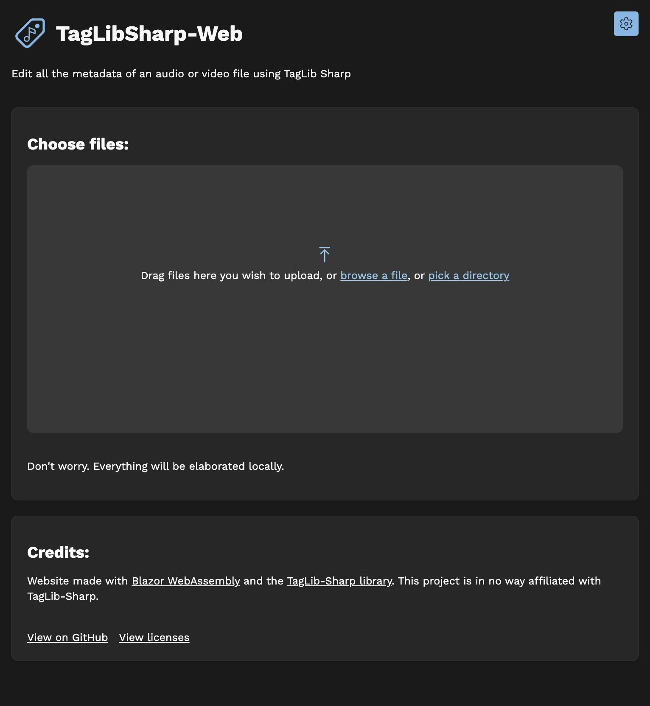
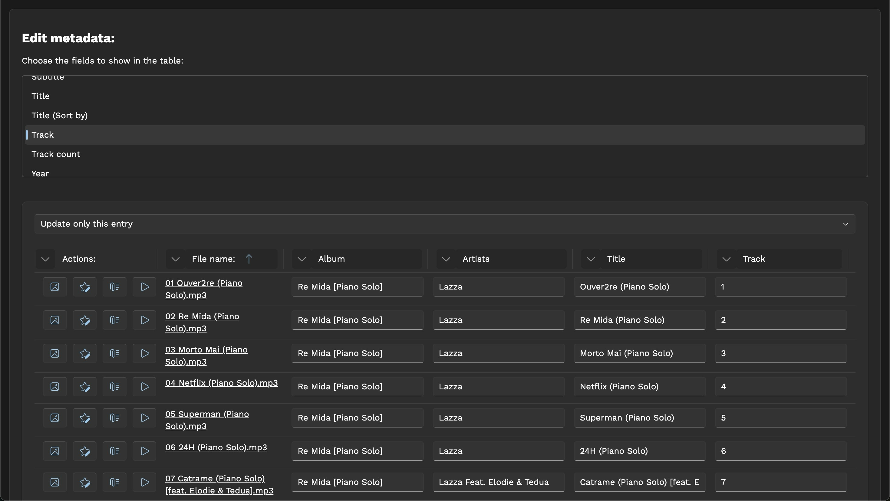

# taglibsharp-web

Edit metadata of audio and video files directly from your browser using
TagLib-Sharp

Try it: https://dinoosauro.github.io/taglibsharp-web/

## Usage

First, open the website. Wait a few seconds that Blazor WebAssembly loads, and
then you'll be able to choose the files to edit:

### Grid UI

The website will read all the files. After that, you'll be able to see your
files in a grid. Before the grid, you can choose which fields to show in the
grid. Click on them and they'll be added automatically.

You'll find a textbox where you can edit all the values. You can also find two
buttons at the left:

- The image icon will show you the "Album art editor" dialog. Here you can see
  the album art of the selected track, and you can remove it, or add another
  one.
- The star icon will show you the "Custom metadata edtor" dialog. Here you can
  add a custom metadata (if the container is supported).

### Single file view

If you want something simpler, you can toggle the "Single file view" from the
Settings. With this, you'll need to select both the file to edit and the
metadata field to edit manually.

In this UI, the "Album art editor" and the "Custom metadata" dialogs can be
accessed by clicking on a button after the textbox. In both of the UIs you'll
find a third button, "Copy metadata", that allows you to copy metadata from a
file to another. You can find more about this below.

### Saving the edits

You can save the edits in three ways:

- Save each file individually
  - On the grid view, press on the file name to save it on your device
  - On the single file view, press on the `Download edited file` button
- Save the files directly on the drive
  - If you're using a Chromium-based browser on desktop, you'll be able to
    select a folder where the files will be written. Note that this will
    overwrite the previously files
  - If you're using another browser, the script will download every file on your
    device
- Save the files in a .zip file
  - A zip file with all the video/audio files will be generated. Extract it and
    you'll find the new files.

You can have a look about this in the screenshot below. The UI might be slightly
different if you're using the "Grid UI". As you can see, these buttons are below
the "Copy metadata" button

### Redownload files

In case you're not using the File System API, in that tab you can download again
the files.

## Extra functionality

### Album art

You can add one (or more) album arts, and edit them, directly from this app. You
can do this by clicking the `Change album art` button if you're using the
`Single file view`, or by clicking the `Image` icon if you're using the
`Grid UI`.

In this dialog, you'll find a preview of the album art. If multiple album arts
are embedded in the file, you can view (and remove) them by choosing a new
element in the Select below the title.

_Tip: if you want to download the album art, right-click it and save it to your
device_

#### Adding a new album art

Let's say you want to add a new album art. Click on the `Add new album art`
button and choose the new image.

Then, you'll find two accordions where you can customize the output image. The
default settings should be enough, but here you can:

- In the `Encoding options` accordion:
  - Choose the output quality of the JPEG image
  - Choosethe maximum width of the re-encoded image
  - Choose the maximum height of the re-encoded image
- In the `Advanced options` accordion:
  - Choose the category of the album art
  - Choose if the image should be re-encoded or not
    - In case you don't want to re-encode it, you'll need to provide the
      mimetype of the image.

Finally, click on the `Add image` button to add it.

#### Saving the edits

You can save the edits in four different ways:

- Save to the current file
- Save to the files that have the same name (but different extension) of the
  selected one
- Save to the files that have the same album name as the selected one
- Save to every file that has been opened in the application

### Custom metadata

You can add custom metadata by providing a key/value pair. If you're editing an
MP4/M4A file, you can also customize the namespace (even if probably you
shouldn't).

Then, you can choose to save the edit to the selected file, or to every file.

### Copy metadata

With this dialog, you can copy the metadata from a file to another. Note that
not all the metadata might be copied.

Choose the source file and the output one. Note that you can copy the metadata
also to every file opened by the application, or only to the files that have the
same name (but different extension). In this last case, you'll need to provide
the extension of the files that'll be copied.

Then, you can choose to overwrite existing tags, and if you want to copy the
album art.

## Settings

In the settings, you can change:

- The website theme: a value closer to the left (0.01) will be darker, and a
  value closer to the right (1) will be lighter.
- The application color
- The view (Grid UI or Single file UI)
- If the File System API should be used for saving a single file (by clicking on
  its name in the Grid UI, or on the `Downloaded edited file` button on the
  Single file UI) (Only on desktop Chromium-based browsers)

## Privacy

This website doesn't collect any data. All the files are elaborated locally, and
the website can be used offline (and installed as a Progressive Web
Application).

This website has been made possible by Blazor WebAssembly and by the
TagLib-Sharp library.
