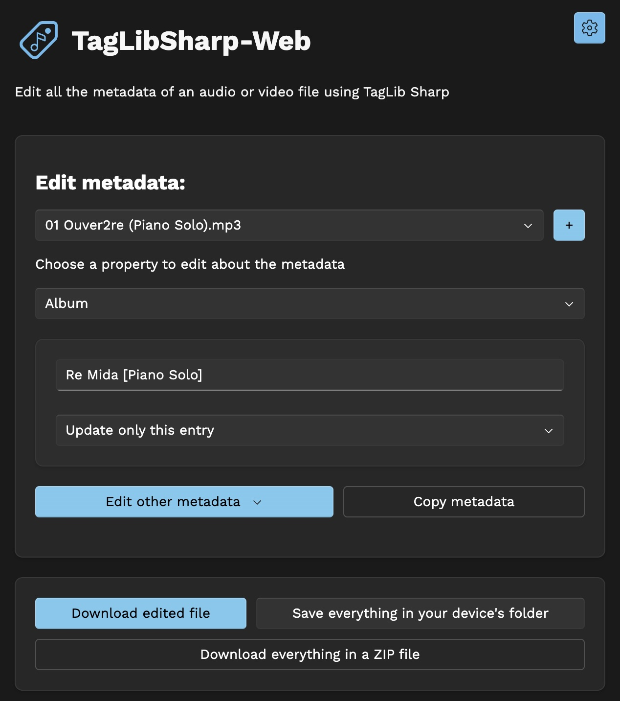
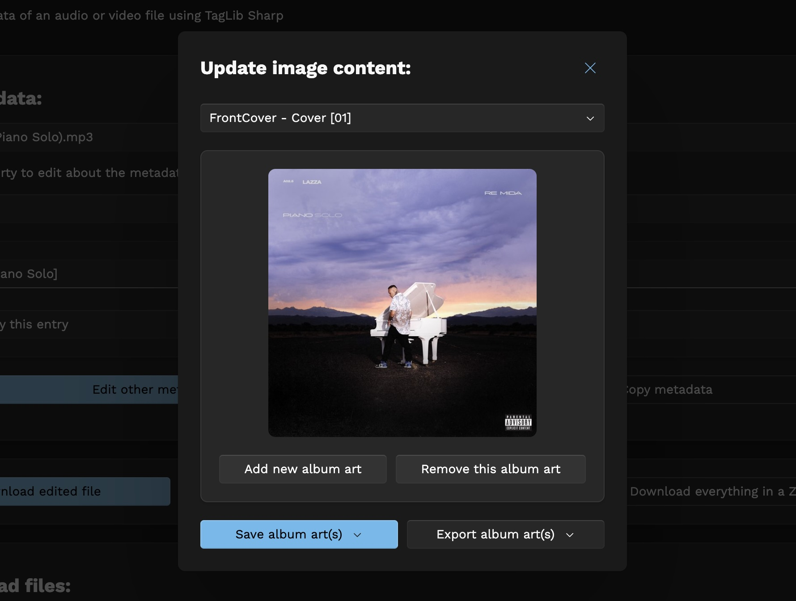
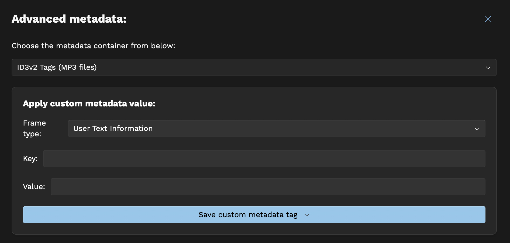

# taglibsharp-web

Edit metadata of audio and video files directly from your browser using
TagLib-Sharp

Try it: https://dinoosauro.github.io/taglibsharp-web/

## Usage

First, open the website. Wait a few seconds that Blazor WebAssembly loads, and
then you'll be able to choose the files to edit:

### Grid UI

The website will read all the files. After that, you'll be able to see your
files in a grid. Before the grid, you can choose which fields to show in the
grid. Click on them and they'll be added automatically.

You'll find a textbox where you can edit all the values. You can also find three
buttons at the left:

- The image icon will show you the `Album art editor` dialog. Here you can see
  the album art of the selected track, and you can remove it, or add another
  one. You can also export the added album arts in a zip file.
- The star icon will show you the `Custom metadata edtor` dialog. Here you can
  add a custom metadata (if the container is supported), see all the metadata that have been added to the audio/video file and also download all the fetched information by TagLib Sharp in either a JSON or CSV (really experimental) file.
- The attachment text icon will show you the `Upload lyrics` dialog. Here you can either upload the lyrics from a local LRC/TTML/text file, or you can fetch them from LRCLib. In this last case, you can also download a zip file with the synced lyrics.

Before the table, you can find a dropdown menu: here you can choose 
- If you want to edit only the single entry;
- If you want to edit all the files;
- If you want to edit the files that have the same album;
- If you want to edit the files that have the same album, but only if the field isn't one that is track-specific (for example, if it's not the track title).

### Single file view

If you want something simpler, you can toggle the "Single file view" from the
Settings. With this, you'll need to select both the file to edit and the
metadata field to edit manually.

In this UI, the three dialogs mentioned above can be
accessed by clicking on the `Edit other metadata` dropdown button. In both of the UIs you'll
find a third button, "Copy metadata", that allows you to copy metadata from a
file to another. You can find more about this below.

### Saving the edits

You can save the edits in three ways:

- Save each file individually
  - On the grid view, press on the file name to save it on your device
  - On the single file view, press on the `Download edited file` button
- Save the files directly on the drive
  - If you're using a Chromium-based browser on desktop, you'll be able to
    select a folder where the files will be written. Note that this will
    overwrite the previously files
  - If you're using another browser, the script will download every file on your
    device
- Save the files in a .zip file
  - A zip file with all the video/audio files will be generated. Extract it and
    you'll find the new files.

You can have a look about this in the screenshot below. The UI might be slightly
different if you're using the "Grid UI". As you can see, these buttons are below
the "Copy metadata" button.

### Redownload files

In case you're not using the File System API, in that tab you can download again
the files.

## Extra functionality

### Album art

You can add one (or more) album arts, and edit them, directly from this app. You
can do this by clicking the `Change album art` button if you're using the
`Single file view`, or by clicking the `Image` icon if you're using the
`Grid UI`.

In this dialog, you'll find a preview of the album art. If multiple album arts
are embedded in the file, you can view (and remove) them by choosing a new
element in the Select below the title.

You can also download:
- The album art you're currently displaying;
- All the album arts of the file you've selected;
- All the album arts of all the files you've loaded
by clicking the `Export album art` dropdown button.

#### Adding a new album art

Let's say you want to add a new album art. Click on the `Add new album art`
button and choose the new image.

Then, you'll find two accordions where you can customize the output image. The
default settings should be enough, but here you can:

- In the `Encoding options` accordion:
  - Choose the output quality of the JPEG image
  - Choosethe maximum width of the re-encoded image
  - Choose the maximum height of the re-encoded image
- In the `Advanced options` accordion:
  - Choose the category of the album art
  - Choose if the image should be re-encoded or not
    - In case you don't want to re-encode it, you'll need to provide the
      mimetype of the image.

Finally, click on the `Add image` button to add it.

#### Saving the edits

You can save the edits in four different ways:

- Save to the current file
- Save to the files that have the same name (but different extension) of the
  selected one
- Save to the files that have the same album name as the selected one
- Save to every file that has been opened in the application.

You'll find all these options in the `Save album art(s)` dropdown menu.

### Custom metadata

#### Adding a custom metadata 
You can add custom metadata by providing a key/value pair. 
- If you're editing an MP4/M4A file, you can also customize the namespace (even if probably you shouldn't);
- If you're editing an MP3 file, you can choose the type of the custom metadata;
- If you're editing an MKV file, you can also add some subkeys.

Then, you can choose to save the edit to the selected file, or to every file.

#### Seeing all the metadata

Below, you'll find a section where you can see all the tags that have been added to the file. You can either delete or remove them. The key displayed is the same used to store the metadata in the container, so you might find a different key that you would expect (ex: `USLT` for lyrics in MP3 files).

#### Exporting metadata

You can also export the metadata in a JSON or CSV (really experimental) file. You can also choose if you want to include binary data or not in the output JSON/CSV.

### Copy metadata

With this dialog, you can copy the metadata from a file to another. 

Choose the source file and the output one. You can copy the metadata:
- From a specific file to another specific one;
- To every file opened by the applicationM
- To the files that have the same name (but different extension).
  * In this case, you'll need to provide the extension of the files that'll be copied.
- To the files that have the same album name.

Then, you can choose to overwrite existing tags, and if you want to copy the
album art. You can also choose to avoid copying metadata fields that are usually specific to each track (for example, track title, track artists, lyrics etc.)

### Fetch lyrics

With this dialog, you can update the lyrics of either the file you've chosen, or all the files loaded in the application, or all the files with no lyrics from either a local file (LRC, TTML and plain text files are supported) or by fetching them from LRCLib. In this last case, you can also save the synced lyrics in a .LRC file that'll be downloaded on your device.

## Settings

In the settings, you can change:

- The website theme: a value closer to the left (0.01) will be darker, and a
  value closer to the right (1) will be lighter.
- The application color
- The view (Grid UI or Single file UI)
- If the File System API should be used for saving a single file (by clicking on
  its name in the Grid UI, or on the `Downloaded edited file` button on the
  Single file UI) (Only on desktop Chromium-based browsers)

## Privacy

This website doesn't collect any data. All the files are elaborated locally, and
the website can be used offline (and installed as a Progressive Web
Application). The only time we might send some data to an external server is if you choose to get the lyrics of your track using LRCLib. In that case, we may share the track name, the album name and the track artists to that provider. You are able to choose what will be shared.

This website has been made possible by Blazor WebAssembly, the TagLib-Sharp library and the Newtonsoft.Json library.
